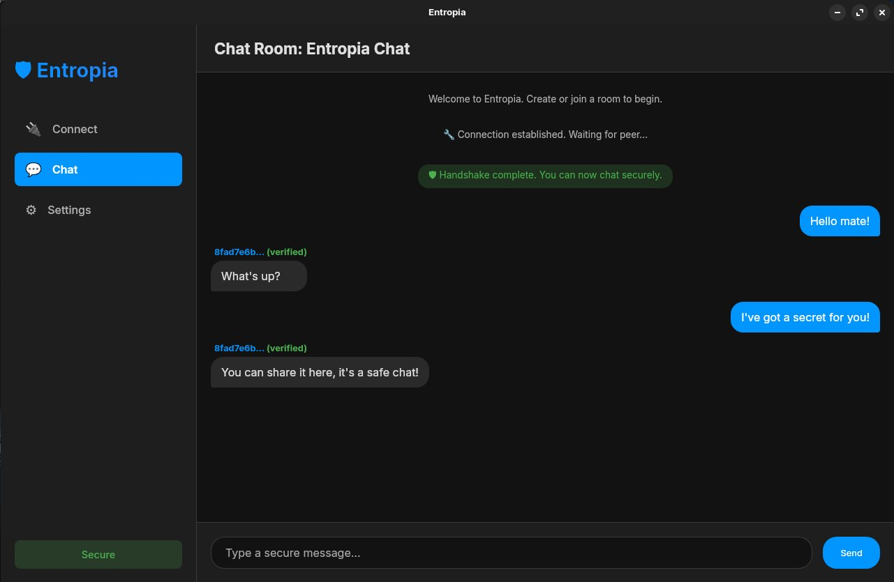

# Entropia 🛡️

<p align="center">
  <a href="https://go.dev/"></a>
  <a href="LICENSE"></a>
  
  
  <a href="http://makeapullrequest.com"></a>
</p>

<p align="center">
  
</p>

## Post-Quantum End-to-End Encrypted Desktop Chat

> **⚠️ Prototype – not for production use.** This software has not been professionally audited. Do NOT rely on it to protect sensitive data.

**Entropia is a modern, peer-to-peer chat application with a clean graphical user interface, built with post-quantum cryptography to ensure your communications are secure against future threats.**

It showcases how to combine NIST-standard quantum-resistant algorithms with peer-to-peer discovery to create a secure, serverless communication channel. The project is actively developed and is headed toward production-readiness. Feedback and contributions are welcome!

Curious about the internals? See the **[Technical Overview](TECHNICAL_OVERVIEW.md)**.

---

## Table of Contents

- [Why Entropia?](#why-entropia)
- [Installation & Usage](#installation--usage)
- [How It Works](#how-it-works)
- [Security](#-security)
- [Logging](#logging)
- [Roadmap](#roadmap)
- [License](#license)

---

## Why Entropia?

-   **🛡️ Quantum-Resistant by Default:** Uses CRYSTALS-Kyber for key exchange and CRYSTALS-Dilithium for signatures, both NIST-standard algorithms, to protect you from "harvest now, decrypt later" attacks.
-   **🖥️ Modern Desktop Experience:** A clean, intuitive, and cross-platform graphical interface built with `webview`. All functionality is integrated into a single, easy-to-use application.
-   **🌐 Zero-Server Architecture:** True peer-to-peer communication with no central servers to compromise, monitor, or shut down. Your data never touches third-party infrastructure.
-   **🔍 Smart Peer Discovery:** Automatically finds peers on your local network (mDNS, UDP Broadcast) or across the internet using the BitTorrent DHT. Manual IP connection is also supported.
-   **🔄 Perfect Forward Secrecy:** Ephemeral key pairs are rotated automatically every 15 minutes, ensuring that a compromised key cannot be used to decrypt past conversations.
-   **⚡ Lightweight & Fast:** Ships as a single, self-contained Go binary with all assets embedded. It's fast, efficient, and uses a reliable QUIC-based transport layer.

---

## Installation & Usage

### Prerequisites

- **Go 1.24+** – install from <https://go.dev/dl/> or your OS package manager.
- **UDP reachable** network (firewalls/NAT that allow an arbitrary UDP port for QUIC).

### Build from source (cross-platform)

```bash
# Clone & build
git clone https://github.com/reschjonas/entropia.git
cd entropia

# Static binary for your OS/arch
go build -trimpath -ldflags="-s -w" -o entropia .

# Or install into $GOBIN in one line
go install github.com/reschjonas/entropia@latest
```

### Running the App

1.  **Start the app:**
    ```bash
    ./entropia
    ```
2.  **Peer 1 (Create Room):**
    - Click "Create & Start Listening".
    - The app will generate a Room ID. Go to the "Settings" tab to find and copy it.
3.  **Peer 2 (Join Room):**
    - Paste the Room ID into the "Join Existing Room" card.
    - Click "Join Room". The app will use auto-discovery (DHT, mDNS) to find the creator.
    - For LAN connections, you can optionally enter the creator's `ip:port`.

You can start chatting once both sides show a **Secure** status.

---

## How It Works

Entropia establishes a secure channel in four main steps:

1.  **Discovery:** The application uses mDNS, UDP broadcasts, and the BitTorrent DHT to find a peer's network address.
2.  **Handshake:** A quantum-safe key exchange is performed using CRYSTALS-Kyber to establish a shared secret.
3.  **Authentication:** Peer identities are verified using CRYSTALS-Dilithium digital signatures. This step is fortified by out-of-band fingerprint verification.
4.  **Secure Chat:** All messages are encrypted with XChaCha20-Poly1305, a modern and highly secure symmetric cipher.

For a deep dive into the architecture and cryptographic protocols, read the **[Technical Overview](TECHNICAL_OVERVIEW.md)**.

---

## 🔒 Security

### Threat Model & Caveats

*   **This is a prototype and has not been audited.** Use it for educational purposes only.
*   **Trust On First Use (TOFU):** You must verify your peer's identity fingerprint out-of-band to prevent man-in-the-middle attacks.
*   **IP Address Visibility:** As a peer-to-peer application, your IP address will be visible to your chat partner. Anonymity is not a goal of this project.

### Fingerprint Verification

This is the most critical step to ensure you are talking to the right person.

1.  Navigate to the **Settings** tab in the application.
2.  You will find your **Identity Fingerprint** and a list of verified peer fingerprints.
3.  Communicate with your peer through a separate, trusted channel (like a video call or in person) and confirm that the fingerprints match on both ends.

---

## Logging

Entropia ships with a **silent-by-default** structured logger.

Enable it with a CLI flag for debugging:

```bash
entropia --log-level info      # debug | info | warn | error
```

---

## Roadmap

* NAT traversal via ICE/QUIC
* Simple group chats (N-peers)
* File transfer & chat history persistence
* Formal security audit

PRs and suggestions are welcome!

---

## License

[MIT](LICENSE)
