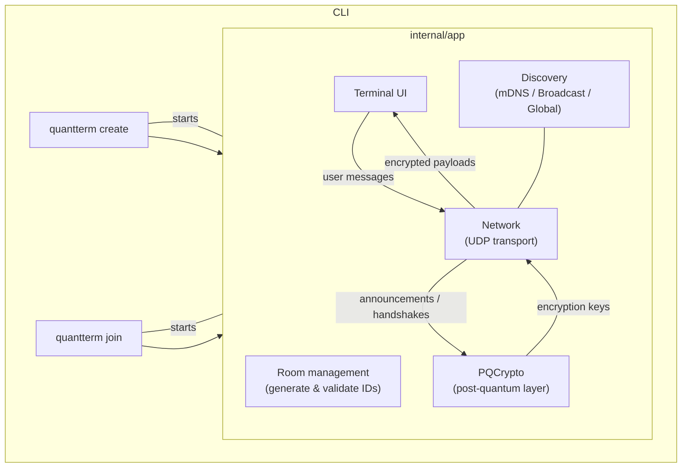

# QuantTerm – Technical Overview

> *A walk-through of the moving parts, crypto choices and data flows.*

## Table of Contents

1. [High-Level Architecture](#1-high-level-architecture)
2. [Crypto Layer](#2-crypto-layer-internalcrypto)
3. [Transport Layer](#3-transport-layer-internalnetwork)
4. [Discovery Layer](#4-discovery-layer-internaldiscovery)
5. [Terminal UI](#5-terminal-ui-internalui)
6. [Lifecycle](#6-lifecycle)
7. [Security Considerations](#7-security-considerations)
8. [Build & Test](#8-build--test)
9. [Future Work](#9-future-work)

---

## 1. High-Level Architecture



*(If the diagram does not render on GitHub, paste it into https://mermaid.live to view.)*

---

## 2. Crypto Layer (`internal/crypto`)

| Purpose | Algorithm | Size |
| :--- | :--- | :--- |
| *Key Encapsulation* | **CRYSTALS-Kyber-1024** | ~8000 bit public key |
| *Digital Signatures* | **CRYSTALS-Dilithium-5** | ~3500 bit public key |
| *Symmetric Encryption* | **ChaCha20-Poly1305 (XChaCha)** | 256-bit key |

### 2.1 Identity keys

Created at start-up once per session.  They are long-term *public* keys that are
included in every peer-announcement and are **signed** with Dilithium.

### 2.2 Handshake flow

1. **Peer Announcement** – Each side broadcasts its identity public keys signed with Dilithium.
2. **Key Exchange** – The initiator encapsulates a Kyber shared secret to the other peer's *identity KEM* key.
3. Both sides derive a 32-byte session key via HKDF and immediately switch to
   **ChaCha20-Poly1305** for chat messages.
4. Keys rotate every 15 minutes; the previous secret is kept around for a grace
   period to decrypt late packets.

Every chat message is:

* serialized (`MessagePayload` JSON),
* sealed with XChaCha20-Poly1305, and
* signed with Dilithium.

---

## 3. Transport Layer (`internal/network`)

* **UDP** is used directly; there is no reliability or congestion control built in.
* The socket is usually bound to an interface inside a **WireGuard** tunnel – the
  encryption inside WG shields our metadata and hides the large PQ keys from
  middleboxes.
* Messages are wrapped in a tiny JSON object (`wgMessage`) with the base-16
  encoded payload plus a type field (`announcement`, `keyexchange`, `message`).

Why not QUIC/TCP?  Keeping the transport dumb helps keep the demo small and
focuses on the cryptography.

---

## 4. Discovery Layer (`internal/discovery`)

Discovery tries **three** methods in parallel and returns the first success:

| Method | Scope | How it works |
| :--- | :--- | :--- |
| **mDNS** | LAN | Service name `_quantterm_<hash>._udp` is advertised & browsed. |
| **UDP Broadcast** | LAN | Peers broadcast a JSON blob to `192.168/10./172.31` broadcast addresses. |
| **Global** | Internet | Listener publishes `ip:port` to [`kvdb.io`](https://kvdb.io).  Joiner polls the key. |

The listener also learns its own public IP with STUN (`stun.l.google.com:19302`).

---

## 5. Terminal UI (`internal/ui`)

A single Go file implements a minimal TUI:

* Displays system, security and chat messages.
* Blocks user input until at least **one verified peer** is present.
* Shows live peer count and E2E status.
* Surfaces identity fingerprints every 60 s for manual verification.

---

## 6. Lifecycle

1. **Creator**
   1. Generates a room ID & binds a UDP socket.
   2. Advertises via discovery layer.
   3. Waits for announcements; sends its own once a datagram is received.
2. **Joiner**
   1. Resolves the creator's address via discovery (or manual CLI arg).
   2. Dials the UDP address; immediately sends its announcement.
   3. Performs key exchange once creator's announcement is verified.
3. **Chatting** – Both sides encrypt/sign every message and verify/decrypt on receipt.
4. **Rotation** – After 15 min, new Kyber ephemerals are generated and exchanged.

---

## 7. Security Considerations

* **Fingerprint verification** is the only protection against a malicious MITM –
  it must happen over a trusted channel.
* The project assumes an honest-but-curious network; it does *not* attempt to
  reach anonymity, resist DoS or provide plausible deniability.
* Only two peers are supported today; adding groups would require a redesigned
  key schedule (e.g. MLS).

---

## 8. Build & Test

```bash
go test ./...
```

*(At the time of writing only a handful of crypto serialization tests exist.)*

---

## 9. Future Work

* Replace KV store with a small DHT or introduce a rendezvous server.
* Improve NAT traversal (ICE, TURN).
* Add optional QUIC transport for reliability.
* Formal security audit. 
