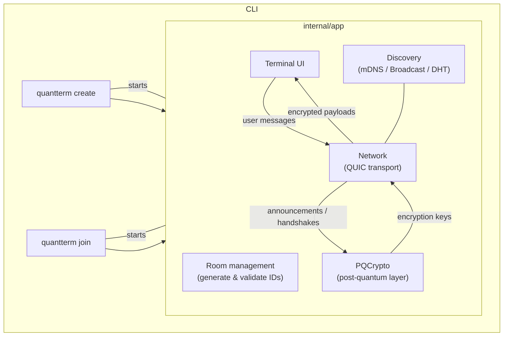

# QuantTerm – Technical Overview

> *A walk-through of the moving parts, crypto choices and data flows.*

## Table of Contents

1. [High-Level Architecture](#1-high-level-architecture)
2. [Crypto Layer](#2-crypto-layer-internalcrypto)
3. [Transport Layer](#3-transport-layer-internalnetwork)
4. [Discovery Layer](#4-discovery-layer-internaldiscovery)
5. [Terminal UI](#5-terminal-ui-internalui)
6. [Lifecycle](#6-lifecycle)
7. [Security Considerations](#7-security-considerations)
8. [Build & Test](#8-build--test)
9. [Logging](#9-logging)
10. [Future Work](#10-future-work)

---

## 1. High-Level Architecture



*(If the diagram does not render on GitHub, paste it into https://mermaid.live to view.)*

---

## 2. Crypto Layer (`internal/crypto`)

| Purpose | Algorithm | Size |
| :--- | :--- | :--- |
| *Key Encapsulation* | **CRYSTALS-Kyber-1024** | ~8000 bit public key |
| *Digital Signatures* | **CRYSTALS-Dilithium-5** | ~3500 bit public key |
| *Symmetric Encryption* | **ChaCha20-Poly1305 (XChaCha)** | 256-bit key |

### 2.1 Identity keys

Created at start-up once per session.  They are long-term *public* keys that are
included in every peer-announcement and are **signed** with Dilithium.

### 2.2 Handshake flow

1. **Peer Announcement**  
   • Identity Kyber **&** Dilithium public keys  
   • **SHA-256 fingerprint of the self-signed QUIC certificate**  
   – All fields are signed with Dilithium.
2. **Key Exchange** – The initiator encapsulates to the peer's **most recent Kyber *ephemeral*** key (falls back to identity key on first contact).  The responder decapsulates with *either* its identity **or** current ephemeral private key.
3. Both sides feed the shared secret into HKDF **together with a fresh 32-byte salt** (carried in every ciphertext header) to derive a 32-byte session key for
   **XChaCha20-Poly1305**.
4. Keys rotate every 15 minutes; the previous secret is kept for a short grace period to decrypt late packets.

Every chat message is:

* serialized (`MessagePayload` JSON),
* a new **32-byte random salt** is generated,
* header fields (`sender`, `recipient`, `timestamp`, `epoch`, `salt`) become **AEAD AAD** and are covered by the MAC,
* payload is sealed with XChaCha20-Poly1305, and
* the complete envelope is signed with Dilithium.

---

## 3. Transport Layer (`internal/network`)

The transport layer is built on **QUIC**, which provides a reliable, stream-based, and encrypted channel between the two peers.

* **QUIC** handles reliability, congestion control, and transport-level encryption (TLS 1.3).
* Each peer uses a self-signed certificate and **signs its SHA-256 fingerprint in the first announcement**. The remote fingerprint is checked right after the QUIC handshake to block early MITM.
* Application-level messages (announcements, key exchanges, chat) are serialized into a simple JSON object and sent over separate QUIC streams. This multiplexing prevents head-of-line blocking between different message types.
* Using a standard protocol like QUIC makes the application more robust and simplifies the transport logic significantly compared to a raw UDP-based approach.

---

## 4. Discovery Layer (`internal/discovery`)

Discovery tries **three** methods in parallel and returns the first success:

| Method | Scope | How it works |
| :--- | :--- | :--- |
| **mDNS** | LAN | Service name `_quantterm_<hash>._udp` is advertised & browsed. |
| **UDP Broadcast** | LAN | Peers broadcast a JSON blob to `192.168/10./172.31` broadcast addresses. |
| **DHT (BitTorrent Kademlia)** | Internet | Listener announces `ip:port` on the public BitTorrent DHT; the joiner performs a traversal to discover peers. |

The listener also learns its own public IP with STUN (`stun.l.google.com:19302`).

---

## 5. Terminal UI (`internal/ui`)

A single Go file implements a minimal TUI:

* Displays system, security and chat messages.
* Blocks user input until at least **one verified peer** is present.
* Shows live peer count and E2E status.
* Surfaces identity fingerprints every 60 s for manual verification.

---

## 6. Lifecycle

1. **Creator**
   1. Generates a room ID & starts a QUIC listener on a UDP port.
   2. Advertises via discovery layer.
   3. Waits for an incoming QUIC connection; sends its own announcement once a peer connects.
2. **Joiner**
   1. Resolves the creator's address via discovery (or manual CLI arg).
   2. Dials the peer's QUIC address; immediately sends its announcement over a new stream.
   3. Performs key exchange once creator's announcement is verified.
3. **Chatting** – Both sides encrypt/sign every message and verify/decrypt on receipt.
4. **Rotation** – After 15 min, new Kyber ephemerals are generated and exchanged.

---

## 7. Security Considerations

* **Fingerprint verification** is the only protection against a malicious MITM –
  it must happen over a trusted channel.
* The project assumes an honest-but-curious network; it does *not* attempt to
  reach anonymity, resist DoS or provide plausible deniability.
* Only two peers are supported today; adding groups would require a redesigned
  key schedule (e.g. MLS).

---

## 8. Build & Test

```bash
go test ./...
```

*(At the time of writing only a handful of crypto serialization tests exist.)*

---

## 9. Logging

The application keeps runtime noise at a minimum by **defaulting to silence**.  Back-end components send their structured logs to an in-memory `slog` logger that discards output unless explicitly enabled.

**How to enable logging**

```bash
# JSON logs on stdout, INFO level
quantterm create --log-level info

# or via environment variable
export QUANTTERM_LOG_LEVEL=debug
quantterm join <RoomID>
```

Levels: `debug`, `info`, `warn`, `error` (case-insensitive).

Internally a call to `logger.L()` returns the shared logger; subsystems never print directly to stdout/stderr.  The network transport also exposes an *error channel* so the UI can surface critical issues without enabling verbose logs.

---

## 10. Future Work

* Improve DHT bootstrap reliability (e.g., multiple well-known bootstrap nodes).
* Add support for group chats (e.g., using a protocol like MLS).
* Add optional persistence for chat history.
* Formal security audit.
* Create a graphical user interface (GUI). 